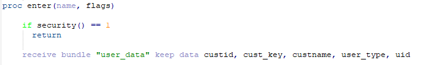

# Notepad++

1) You may import this User Definition XML File into Notepad++ from the Menu.
   Click on Language-> User Defined Language-> Define your Language-> Import-> select the XML file
2) Restart Notepad++.
3) Click on Language in the menu bar, scroll down and select JPL.
4) Notice all JPL verbs will be highlighted.

Illustration:

Need a Panther Web 552 Redhat Image? [Click Here](https://hub.docker.com/r/prolificspanther/pantherweb "Named link title") 

How to set up a Panther Servlet Web Application? [Click Here](https://github.com/ProlificsPanther/PantherWeb/releases "Named link title")

Read our Documentation [here](https://docs.prolifics.com)
